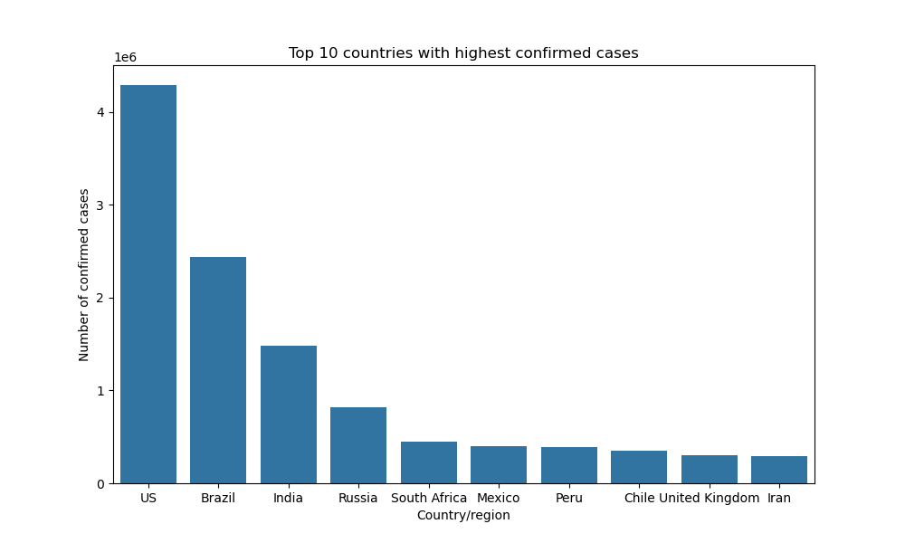
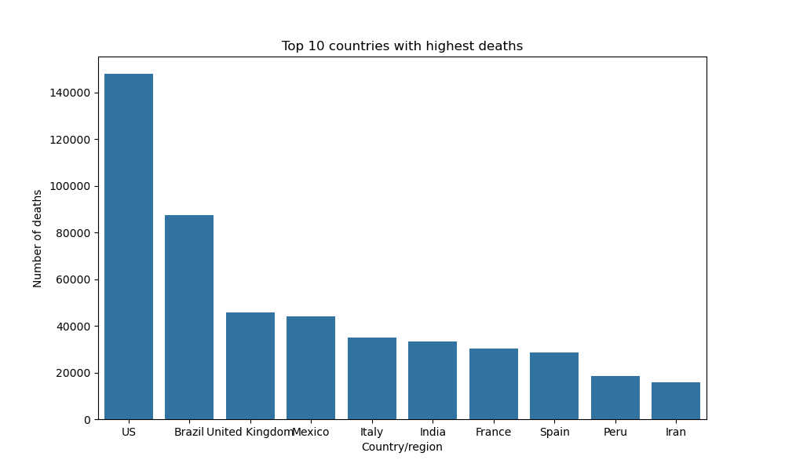
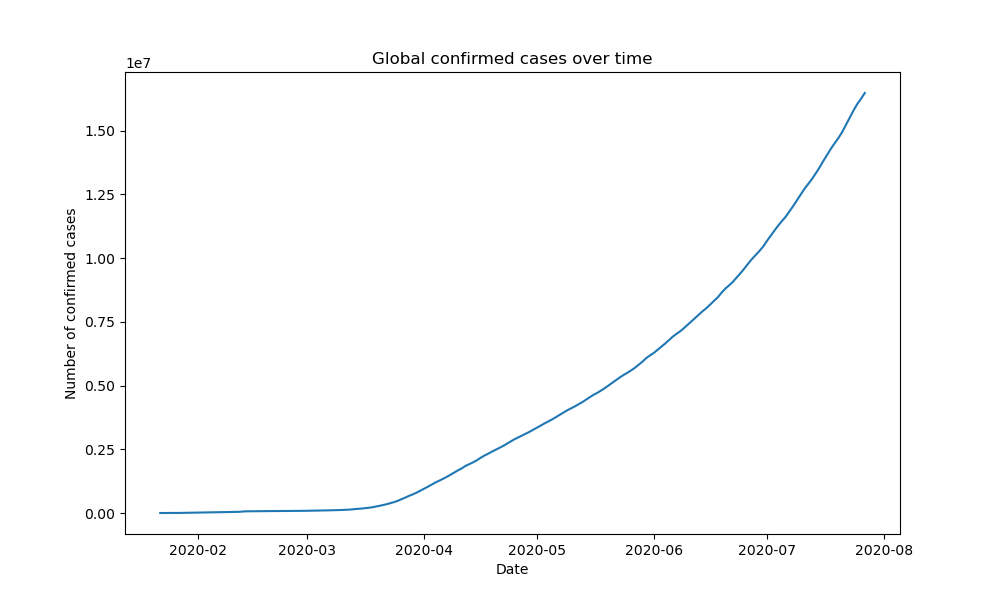
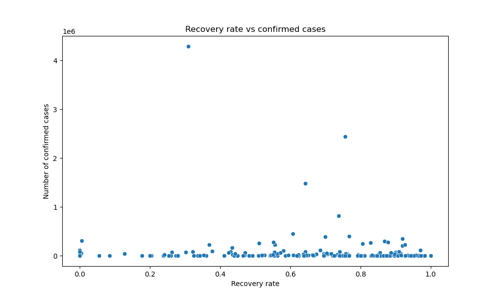
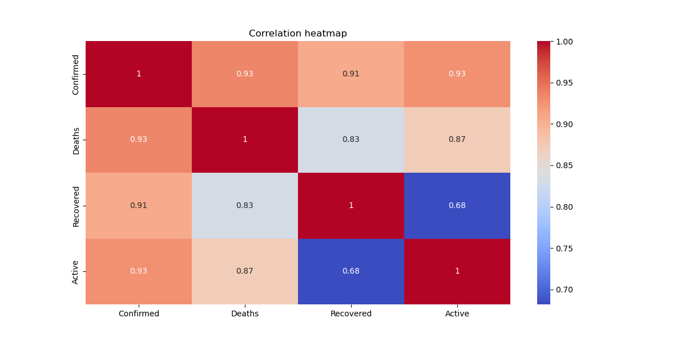

# COVID-19 Data Analysis

## Project Overview

This project looks at global COVID-19 data to understand how the pandemic affected different countries. It focuses on spotting trends in confirmed cases, deaths, recoveries, and active cases using data visualization and basic data analysis techniques in Python.

The goal is to practice real-world data analysis and gain insights from publicly available COVID-19 datasets.

---

## Datasets Used

Three datasets were used in this project:

* **country_wise_latest.csv** – Contains the latest COVID-19 statistics for each country.
* **day_wise.csv** – Shows global COVID-19 data recorded day by day.
* **covid_19_clean_complete.csv** – Provides detailed COVID-19 statistics for each country over time.

---

## Tools and Libraries

The analysis used the following tools:

* Python
* Pandas
* Matplotlib
* Seaborn
* Jupyter Notebook

---

## Analysis Performed

In this project, the following analyses were done:

* Identified the top 10 countries with the highest confirmed COVID-19 cases.
* Compared death counts across countries.
* Analyzed how COVID-19 cases rose over time globally.
* Calculated recovery rates for different countries.
* Compared recovery rates with confirmed cases.
* Identified countries with the highest active cases.

---

## Key Insights

* The United States, India, and Brazil reported the most confirmed COVID-19 cases.
* Global cases grew quickly during the early stages of the pandemic.
* Recovery rates varied between countries based on healthcare capacity.
* Some countries showed higher death rates compared to their total confirmed cases.

---
## Visualizations

### Top 10 Countries with Highest Confirmed Cases

### Top 10 Countries with Highest Deaths

### Global COVID Case Trend

### Recovery Rate vs Confirmed Cases

### Correlation Heatmap

Several visualizations were created during the analysis, including:

* Bar charts comparing COVID statistics at the country level.
* Line charts showing the growth of global cases over time.
* Scatter plots comparing recovery rates and confirmed cases.

## Conclusion

This project showed how data analysis and visualization can improve our understanding of real-world events like the COVID-19 pandemic. By exploring the datasets, we can spot patterns in infection rates, recovery rates, and the overall impact of the virus across different countries.

---

## Author

Shailesh Kumar
